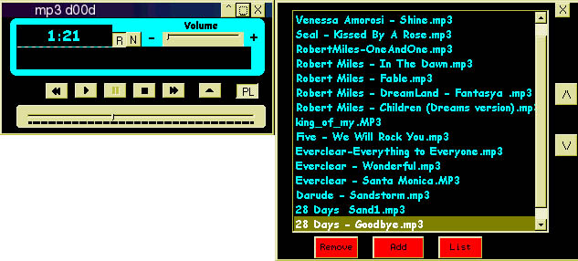



## mp3 d00d BETA

### Description

This is a fairly complex mp3 player, has similar functions to winamp (shuffle, repeat etc)...Allows you to save a playlist and open it from anywhere on your copmuter. This code still has a few bugs, and does need some major error handling. Some code has been borrowed from misc people on this website so all credit does not goto me... Please leave your comments, and also report any other bugs to me please

this code is not 100% perfect, and i know it does contain alot of bugs but nothing very major. thanks
 
### More Info
 

             |
---                |---
**Submitted On**   |2000-09-15 14:21:26
**By**             |[Jared Mooring](https://github.com/Planet-Source-Code/PSCIndex/blob/master/ByAuthor/jared-mooring.md)
**Level**          |Intermediate
**User Rating**    |4.3 (13 globes from 3 users)
**Compatibility**  |VB 6\.0
**Category**       |[Sound/MP3](https://github.com/Planet-Source-Code/PSCIndex/blob/master/ByCategory/sound-mp3__1-45.md)
**World**          |[Visual Basic](https://github.com/Planet-Source-Code/PSCIndex/blob/master/ByWorld/visual-basic.md)
**Archive File**   |[CODE\_UPLOAD98989142000\.zip](https://github.com/Planet-Source-Code/jared-mooring-mp3-d00d-beta__1-11483/archive/master.zip)

